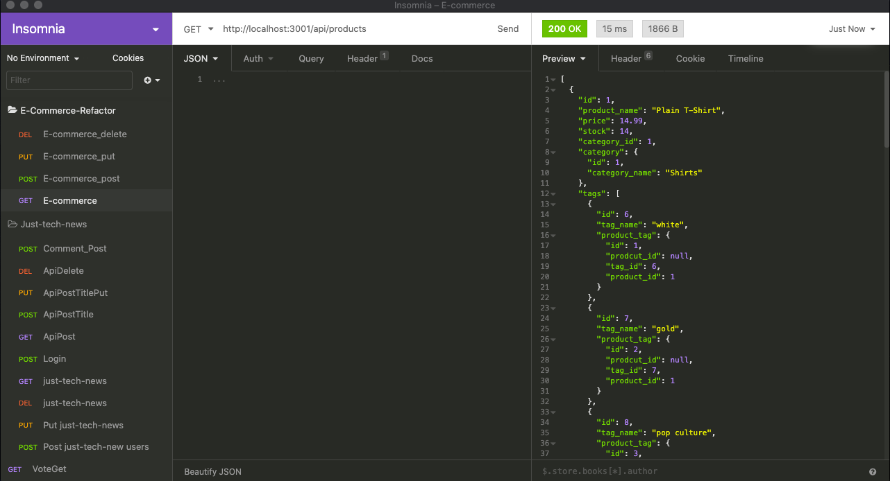

# E-commerce Back End Starter Code

## [Click to watch the Tutorial Video]()

# Description
This program uses Mysql and Sequelize to store the data, the database will be seed for the purposes of the test, we will be using the Insomnia Core software to be able to do all the tests to verify that our coding is with good functionality, we will be demonstrating how to get the data, how to update it, also delete and add products to our database. In addition we will be demonstrating how to start the database and also seed the data to it.

## Lenguages used
* JavaScript

## Dependencies
* Inquirer
* Dotenv
* Express
* MySQL
* Sequelize

## Screenshots

# Contribution

By [Mario Viana](https://github.com/marioviana07/E-Commerce-Refactor)

